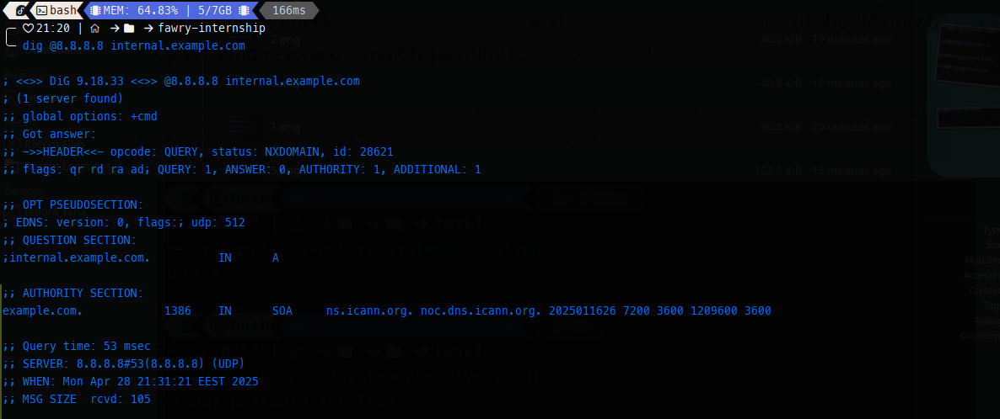
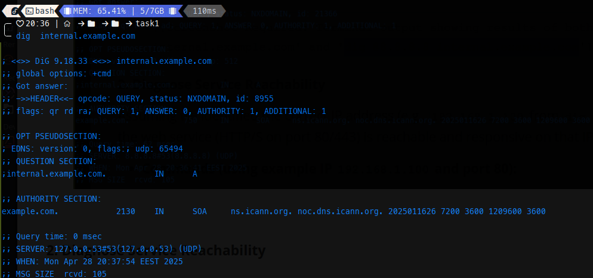
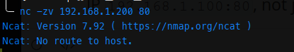
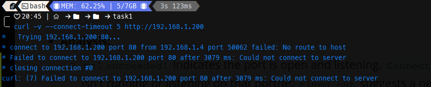
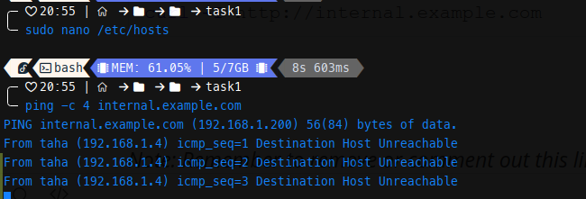
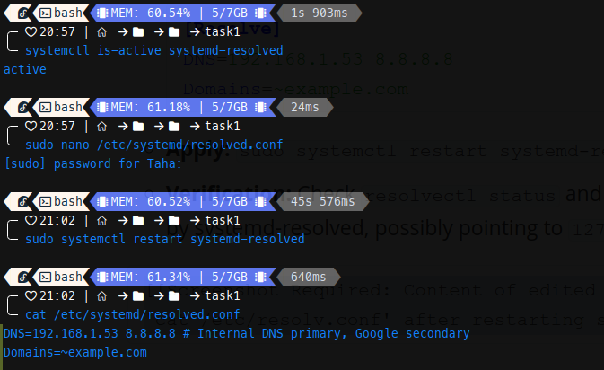

# task 1

  
 
  ---
  
# task 2
**1. Verify DNS Resolution**

First, we need to determine if the DNS resolution for `internal.example.com` is functioning correctly. We will compare the result from the system's configured DNS server (via `/etc/resolv.conf`) against a reliable public DNS server (`8.8.8.8`).

* **Commands:**

  ```bash
  # Query using system's default DNS resolver
  dig internal.example.com
  
  # Query using Google's public DNS server
  dig @8.8.8.8 internal.example.com
  ```

* **Analysis:**
  Execute both commands. Observe the `status:` and `ANSWER SECTION` in the output.

  *   If the first command fails (e.g., `status: NXDOMAIN`) but the second command succeeds (`status: NOERROR` with an IP address in the `ANSWER SECTION`, let's assume `192.168.1.200`), it strongly indicates an issue with the local DNS configuration or the configured internal DNS server. This is the most likely scenario given the "host not found" error.
  *   If both fail, the DNS record might not exist anywhere, or there's a broader network issue preventing DNS queries.
  *   If both succeed with the same IP, the initial "host not found" error might be transient or related to something other than basic DNS resolution (like client-side caching or specific application behavior).
  *   If both succeed but with different IPs, there's a DNS record inconsistency.

  




**2. Diagnose Service Reachability**

Assuming we identified the correct IP address (e.g., `192.168.1.200` from `dig @8.8.8.8`), we must verify if the web service (HTTP/S on port 80/443) is reachable and responsive on that IP.

* **Commands (using example IP `192.168.1.200` and port 80):**

* ```bash
  nc -zv 192.168.1.200 80
  ```

  

* 

  ```bash
  curl -v --connect-timeout 5 http://192.168.1.200
  ```

  

* **Analysis:**

  *   `nc`: `succeeded!` indicates the port is open and listening. `Connection refused` means the service isn't running or listening on that port/IP. `timed out` suggests a network path issue or a firewall blocking the connection.
  *   `curl`: Successful retrieval of HTML or headers confirms the web service is running and accessible via IP. Failures (timeout, connection refused) corroborate `nc` results.
 
  **3. Trace the Issue – List All Possible Causes**

Here is a comprehensive list of potential reasons why `internal.example.com` might be unreachable, even if the service process is running:

*   **DNS Layer Issues:**
    *   **Incorrect Client DNS Configuration:** Client machine's `/etc/resolv.conf` points to a non-functional or incorrect DNS server. (Most likely based on Step 1).
    *   **Missing/Incorrect DNS Record:** The A or CNAME record for `internal.example.com` is missing or incorrect on the DNS server the client is using.
    *   **DNS Server Down/Unreachable:** The configured DNS server is offline or unreachable over the network.
    *   **DNS Caching:** Stale DNS cache on the client or an intermediate resolver.
    *   **Firewall Blocking DNS:** Firewall (client, network, or server-side) blocking UDP/TCP port 53.
*   **Network/Service Layer Issues:**
    *   **Firewall Blocking HTTP/HTTPS:** Firewall (client, network, or server-side) blocking TCP port 80/443 to the server's IP.
    *   **Web Server Not Running:** The web server process (Nginx, Apache) is stopped on the server.
    *   **Web Server Listening on Wrong Interface/Port:** Service is only listening on `localhost` (127.0.0.1) or a non-standard port.
    *   **Web Server Misconfiguration:** Incorrect `VirtualHost` (Apache) or `server` block (Nginx) configuration for `internal.example.com`.
    *   **Routing Problems:** Client machine lacks a route to the server's network subnet.
    *   **Server Resource Exhaustion:** High CPU, RAM, or disk I/O on the server causing the web service to become unresponsive.
    *   **IP Address Conflict:** Another device on the network is using the same IP address as the web server.

**4. Propose and Apply Fixes**

For each potential cause identified, here's how to confirm it and the command(s) to apply a fix:

| Potential Cause                        | Confirmation Method                                          | Fix Command / Action                                         |
| :------------------------------------- | :----------------------------------------------------------- | :----------------------------------------------------------- |
| **(DNS)** Incorrect Client DNS Config  | `cat /etc/resolv.conf` shows incorrect `nameserver` entries. `dig internal.example.com` fails, `dig @<correct_DNS_IP> internal.example.com` succeeds. | **(Temporary):** `sudo nano /etc/resolv.conf`, correct `nameserver` lines. **(Permanent):** Use `systemd-resolved` or `NetworkManager` configuration methods (see Bonus section). `[[Screenshot Required: Content of /etc/resolv.conf before the fix]]` |
| **(DNS)** Missing/Incorrect DNS Record | `dig @<correct_DNS_IP> internal.example.com` returns `NXDOMAIN` or wrong IP. | Access the DNS server management interface (e.g., BIND zone file, Windows DNS Manager) and add/correct the A record for `internal.example.com` pointing to `192.168.1.200`. Requires DNS admin action, no single client command. Example BIND entry: `internal IN A 192.168.1.200`. Then reload DNS service: `sudo systemctl reload bind9` (or equivalent). |
| **(DNS)** DNS Server Down/Unreachable  | `ping <correct_DNS_IP>` fails. `dig @<correct_DNS_IP> google.com` times out. | Troubleshoot the DNS server itself (check service status, logs, network connectivity). `ssh dns-admin@<dns-server-ip>; systemctl status <dns-service-name>; journalctl -u <dns-service-name>`. |
| **(DNS)** Firewall Blocking DNS        | `dig @<correct_DNS_IP> google.com` times out, but `ping <correct_DNS_IP>` might work. Check client firewall rules (`sudo ufw status`, `sudo iptables -L OUTPUT`). | Allow outgoing DNS traffic: `sudo ufw allow out 53/udp && sudo ufw allow out 53/tcp`. Or configure network firewall if applicable. |
| **(Network)** Firewall Blocks HTTP/S   | `ping <server_IP>` succeeds, but `nc -zv <server_IP> 80` fails (timeout/refused). Check server firewall (`sudo ufw status`, `sudo firewall-cmd --list-all`). | **(On Server):** Allow incoming HTTP/S traffic: `sudo ufw allow 80/tcp && sudo ufw allow 443/tcp`. Or `sudo firewall-cmd --permanent --add-port=80/tcp --add-port=443/tcp && sudo firewall-cmd --reload`. `[[Screenshot Required: Server firewall status before allowing ports]]` |
| **(Service)** Web Server Not Running   | **(On Server):** `systemctl status nginx` shows `inactive (dead)`. `ss -tulnp | grep ':80\|:443'` shows no listening process. | **(On Server):** Start and enable the service: `sudo systemctl start nginx && sudo systemctl enable nginx`. Check logs for errors: `journalctl -u nginx` or `tail /var/log/nginx/error.log`. |
| **(Service)** Wrong Interface/Port     | **(On Server):** `ss -tulnp | grep ':80\|:443'` shows listening on `127.0.0.1:80` instead of `0.0.0.0:80` or `<server_IP>:80`. | **(On Server):** Edit web server config (e.g., `listen` directive in Nginx site file `/etc/nginx/sites-available/default` or Apache `ports.conf`) to listen on `0.0.0.0` or the specific IP. Restart service: `sudo systemctl restart nginx`. |
| **(Service)** Web Server Misconfig     | **(On Server):** `curl http://localhost` works, but `curl -H "Host: internal.example.com" http://localhost` returns default page or error. Check VHost. | **(On Server):** Correct `server_name internal.example.com;` (Nginx) or `ServerName internal.example.com` (Apache) in the appropriate virtual host config file. Test config: `sudo nginx -t` or `sudo apachectl configtest`. Reload service: `sudo systemctl reload nginx`. |
| **(Network)** Routing Problems         | `ip route get 192.168.1.200` fails or shows wrong gateway. `traceroute 192.168.1.200` fails or takes an incorrect path. | Add a static route if necessary: `sudo ip route add <server_network>/<prefix> via <gateway_IP> dev <interface>`. Make persistent via `NetworkManager`, `netplan`, or `/etc/network/interfaces`. |

**Bonus: Configure /etc/hosts Entry for Testing**

To bypass DNS resolution entirely for testing, add a static entry to the client's `/etc/hosts` file.

* **Command:**

  ```bash
  # Edit the hosts file with root privileges
  sudo nano /etc/hosts
  
  # Add the following line at the end, using the correct IP
  192.168.1.100   internal.example.com
  
  # Save the file (Ctrl+O, Enter in nano) and exit (Ctrl+X)
  ```

* **Verification:**

  ```bash
  # Ping should now resolve directly to the specified IP
  ping -c 4 internal.example.com
  # Connectivity test should work if the network/service layers are okay
  curl -I http://internal.example.com
  ```

  

  

**Bonus: Persist DNS Server Settings**

Directly editing `/etc/resolv.conf` is often temporary. Use the system's network management tools for persistent changes:

1. **Using `systemd-resolved`:**

   * **Check if active:** `systemctl is-active systemd-resolved`

   * **Edit configuration:** `sudo nano /etc/systemd/resolved.conf`
     Under `[Resolve]`, set `DNS=` and optionally `Domains=`:

     ```ini
     [Resolve]
     DNS=192.168.1.53 8.8.8.8 
     Domains=~example.com 
     ```

   * **Apply:** `sudo systemctl restart systemd-resolved`




